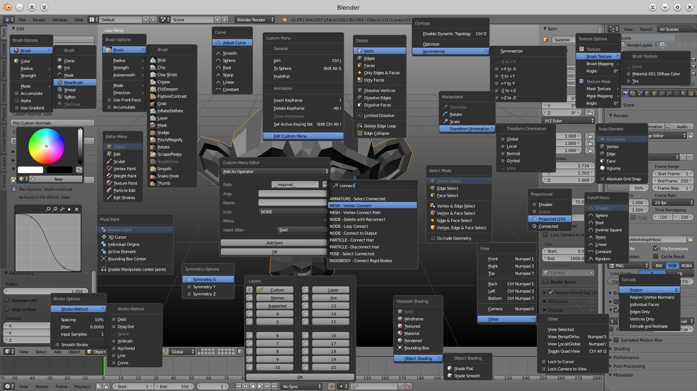

  

## Description:

  Menus to aid the user and increase the speed of interacting with blender's UI.  

## Installation Instructions:

  *  Download the script then unpack and copy the folder advanced_ui_menus into your addons folder.  
  * Open Blender and go to the addons tab in User Preferences.  
  * Enable the script.  

## Shortcuts:

  * Brush menu = V (works in: Sculpt mode, Vertex Paint mode, Weight Paint mode, Texture Paint Mode, Particle Edit Mode)  
  * Curve menu = W (works in: Sculpt mode, Vertex Paint mode, Weight Paint mode, Texture Paint Mode)  
  * Custom menu = Alt-MiddleMouse  
  * Delete menu = X  
  * Dyntopo menu = Ctrl-D__
  * Collection Manager = M  
  * Manipulator = Alt-Space  
  * Mesh Selection menu = Ctrl-Tab  
  * Mesh Extrude = E - Tap for extrude, hold for menu  
  * Mode menu = Tab - Tap for toggle(last/edit), hold for menu  
  * Pivot Point menu = .  
  * Proportional = O - Tap for toggle(last/off), hold for menu  
  * Proportional falloff = Shift-O  
  * Shading mode = Z - Tap for toggle(last/wireframe), hold for menu  
  * Snapping = Shift-Tab - Tap for toggle(on/off), hold for menu  
  * Stroke menu = E (works in: Sculpt mode, Vertex Paint mode, Weight Paint mode, Texture Paint Mode)  
  * Symmetry menu = Alt-S (works in: Sculpt mode, Texture Paint Mode)  
  * Texture menu = R (works in: Sculpt mode, Vertex Paint mode, Texture Paint Mode)  
  * View menu = Alt-Q  

## Custom Menu Tutorial:

  The Custom Menu is a menu that you can customize with Operators, Separators, Labels, Properties, and other Menus as you see fit. Custom Menus can be created for any mode in the 3D View as well as for other editors like the node editor, dopesheet, console, etc..

To Add An Item:

  * open the menu (Alt-MiddleMouse), and click Edit Custom Menu.

  * (Required)  
    Select what type of item you would like to add from the drop down list at the top of the window.

  * (Required for Operators, Menus, Properties)  
    Click on the button to the right of the path field, this will bring up a searchable menu with a list of all paths, click on a path and the path field will be filled in.

  * (Optional, Operators Only)  
     The Args field will autofill with all possible arguments with their default values. Warning - If you want to modify them make sure to leave a space between the comma and the next argument.

  * (Optional)  
    Fill in the Name field if you want a custom name, otherwise the default name (for the operator/menu/property) will be used.

  * (Optional)  
    Select an icon from the list.

  * (Optional, Properties Only)  
    There are a number of checkboxes that control how the property is displayed in the menu, e.g. if you check the slider checkbox the item in the menu will appear (and work) as a slider and allow you to click and drag to change the value or if you just click on it you can type in a value.

  * (Required)  
    The last field on the window controls where the item is placed in the menu; the item will be placed directly under the item you specify from the list.

  * (Required)  
    Click the Add Item button to add the item.

*Note - clicking the OK button does nothing and just closes the window

If you make a mistake the item will still show up in the menu, but it will be greyed out and have a warning icon. To fix this remove the item and re-add it.

If you make a mistake with Operator arguments a submenu will appear at the bottom of the menu with a list of the items that have invalid arguments.

To Remove An Item:

  * open the menu and click Edit Custom Menu. 

  * Select Remove An Item from the drop down list at the top of the window. 

  * Select which item to remove from the list. 

  * Click the Remove Item button to remove the item.
